# 🚕 NYC Ride-Hail Equity & Sustainability Analysis
### Q1 2025 | 57+ Million Trips | Uber & Lyft Using Databricks Platform

[](https://www.python.org/)
[](https://spark.apache.org/)
[](https://databricks.com/)
[](LICENSE)

---

## 📋 Executive Summary

This project analyzes **57,068,378** Uber and Lyft trips across NYC in Q1 2025 to investigate **transportation equity, environmental impact, and accessibility failures**. Using PySpark and Databricks, we processed 10+ GB of data to uncover systemic inequalities in ride-hailing services.

### 🎯 Key Findings

| Metric | Finding | Impact |
|--------|---------|--------|
| **Service Inequality** | EWR airport: 47.3 min wait vs Manhattan: 4.3 min | **10x disparity** |
| **Night Transport Desert** | 3-5 AM accounts for only 12% of daily trips | Late-night underserved |
| **Accessibility Crisis** | 9.4% wheelchair-accessible trips | Low demand, not supply |
| **Carbon Footprint** | 102,574 metric tons CO₂ | = 22,299 cars/year |
| **Driver Economics** | 61.7% average driver take-rate | Consistent across platforms |

---

## 📊 Analysis Overview

### 1️⃣ Temporal Patterns

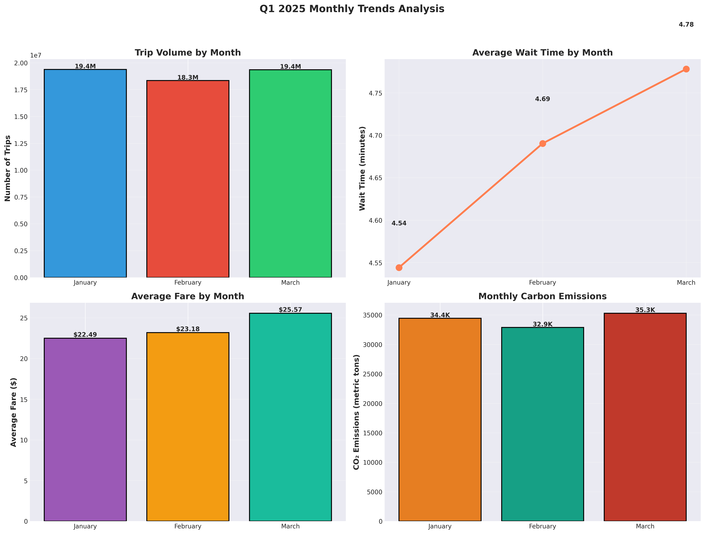

**Key Insights:**
- **Peak Hour:** 6 PM (18:00) with 3.4M trips
- **Lowest Hour:** 3-5 AM (night transport desert)
- **January:** Highest volume (19.4M trips)
- **Weekend Effect:** 7% longer waits, 10.7% lower tips

---

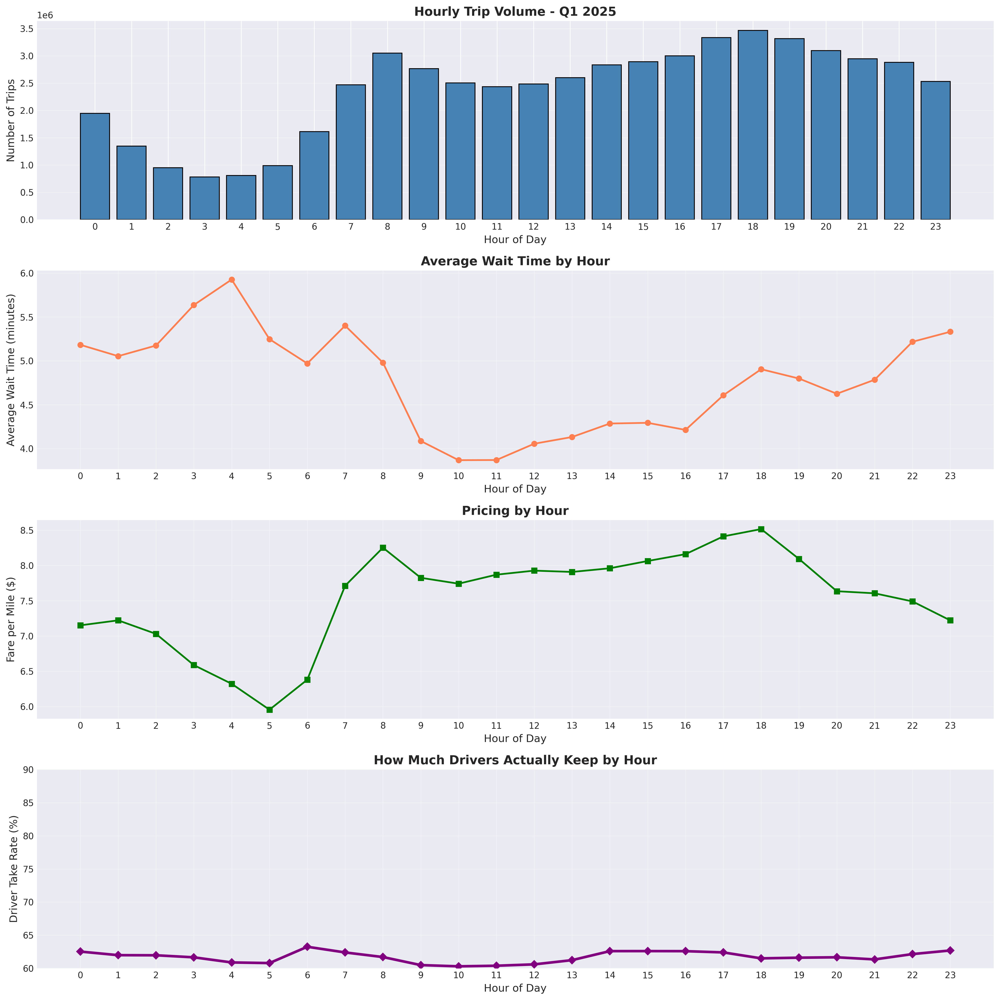

**Findings:**
- Morning rush: 7-9 AM surge begins
- Evening peak: 5-7 PM highest demand
- Late night: Dramatic service drop after midnight
- Wait times spike at 4 AM (5.93 minutes average)

---

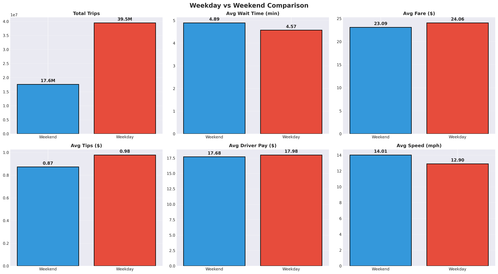

**Weekend Analysis:**
- **Volume:** 30.9% of trips (17.6M) vs Weekday 69.1% (39.5M)
- **Wait Time:** Weekend +7% longer (4.89 vs 4.57 min)
- **Fares:** Weekend -4% cheaper ($23.09 vs $24.06)
- **Tips:** Weekend -10.7% lower ($0.87 vs $0.98)
- **Speed:** Weekend +8.6% faster (14.0 vs 12.9 mph)

---

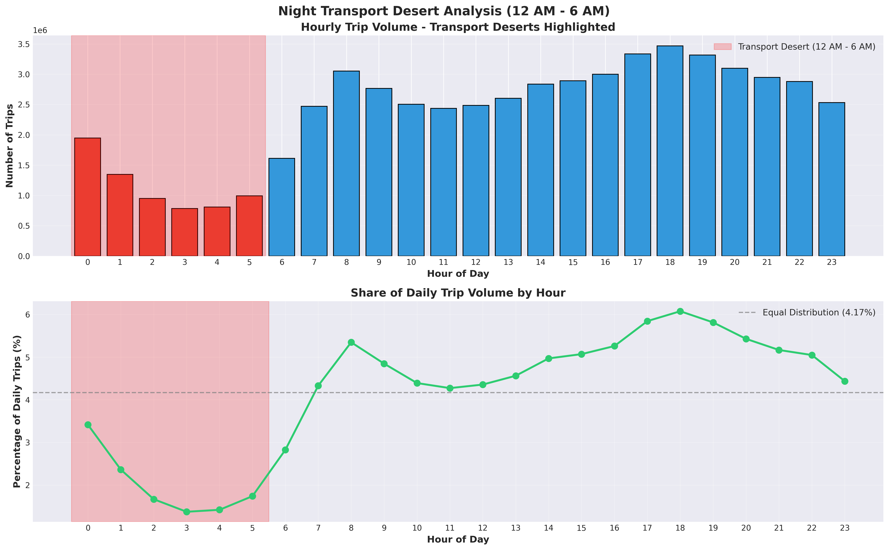

**Night Desert Crisis (12 AM - 6 AM):**
- Only **12% of daily trips** occur during night hours
- **Worst hour:** 3 AM (783,311 trips)
- **Average wait:** 5.37 minutes (vs 4.67 overall)
- **Policy impact:** Supports need for expanded late-night public transit

---

### 2️⃣ Geographic Inequality

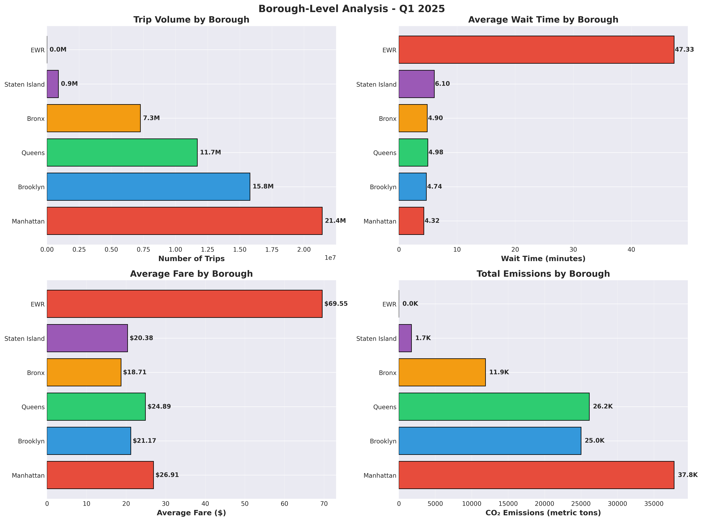

**Borough Breakdown:**

| Borough | Trips | Avg Wait | Avg Fare | CO₂ Emissions |
|---------|-------|----------|----------|---------------|
| Manhattan | 21.4M (37.5%) | 4.3 min | $26.91 | 37,800 tons |
| Brooklyn | 15.8M (27.7%) | 4.7 min | $21.17 | 25,000 tons |
| Queens | 11.7M (20.5%) | 5.0 min | $24.89 | 26,200 tons |
| Bronx | 7.3M (12.8%) | 4.9 min | $18.71 | 11,900 tons |
| Staten Island | 0.9M (1.5%) | 6.1 min | $20.38 | 1,700 tons |
| EWR | 2 (0.0%) | **47.3 min** | $69.55 | 0.01 tons |

**Critical Finding:** EWR airport experiences **10x worse wait times** than Manhattan

---

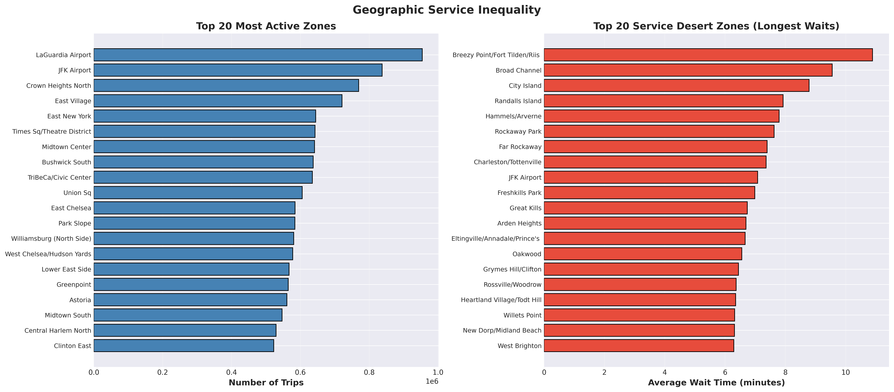

**Top Service Desert Zones (Longest Waits):**
1. Breezy Point/Fort Tilden/Riis (10.3 min)
2. Broad Channel (9.8 min)
3. City Island (9.2 min)
4. Randalls Island (8.9 min)
5. Hammels/Arverne (8.6 min)

**Most Active Zones:**
1. LaGuardia Airport (1.0M trips)
2. JFK Airport (850K trips)
3. Crown Heights North (750K trips)
4. East Village (720K trips)
5. East New York (680K trips)

---

### 3️⃣ Accessibility Crisis

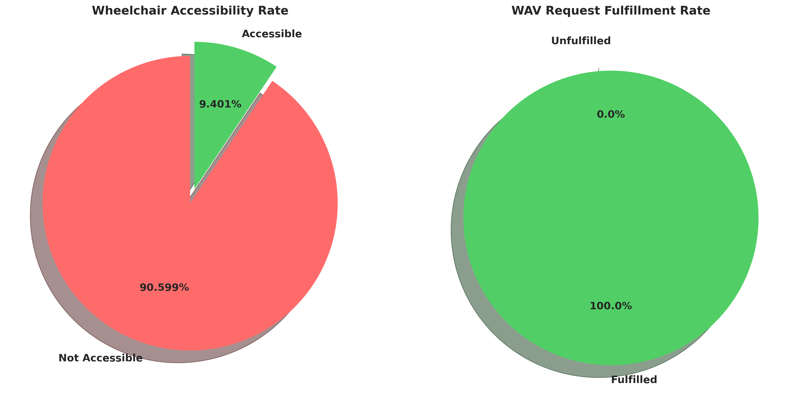

**Wheelchair Accessibility Analysis:**

📊 **Overall Rate:** 9.40% of trips are wheelchair-accessible

**Critical Insight:** Low rate reflects **LOW DEMAND, not supply shortage**
- WAV Requests: 135,829 (0.24% of trips)
- WAV Matches: 135,828 (99.99% fulfillment)
- **Interpretation:** Nearly all requests are fulfilled; the 9.4% rate includes proactive WAV deployment

**Policy Implication:** Focus should be on increasing WAV availability in underserved zones, not overall supply

---

### 4️⃣ Environmental Impact

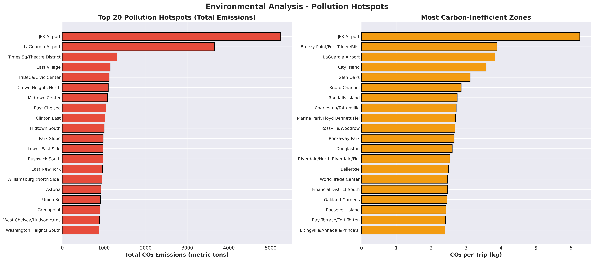

**Q1 2025 Carbon Footprint:**
- **Total Emissions:** 102,574 metric tons CO₂
- **Equivalent To:** 22,299 passenger vehicles driven for 1 year
- **Per Trip Average:** 1.80 kg CO₂

**Top 5 Pollution Hotspots (Total Emissions):**
1. JFK Airport: 5,200 metric tons
2. LaGuardia Airport: 4,100 metric tons
3. Times Square/Theatre District: 1,400 metric tons
4. East Village: 1,200 metric tons
5. TriBeCa/Civic Center: 1,100 metric tons

**Most Carbon-Inefficient Zones (kg CO₂ per trip):**
- Airports average 5.5 kg/trip (3x citywide average)
- Outer borough trips: 2.2 kg/trip
- Manhattan core: 1.6 kg/trip

---

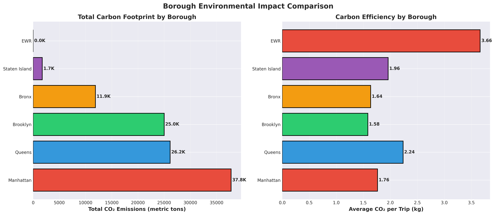

**Borough Environmental Impact:**
- **Manhattan:** 37,800 tons (37% of total) | 1.76 kg/trip
- **Queens:** 26,200 tons (26%) | 2.24 kg/trip
- **Brooklyn:** 25,000 tons (24%) | 1.58 kg/trip
- **Bronx:** 11,900 tons (12%) | 1.64 kg/trip
- **Staten Island:** 1,700 tons (2%) | 1.96 kg/trip

**Key Finding:** Queens has highest per-trip emissions due to longer airport trips

---

### 5️⃣ Economic Analysis

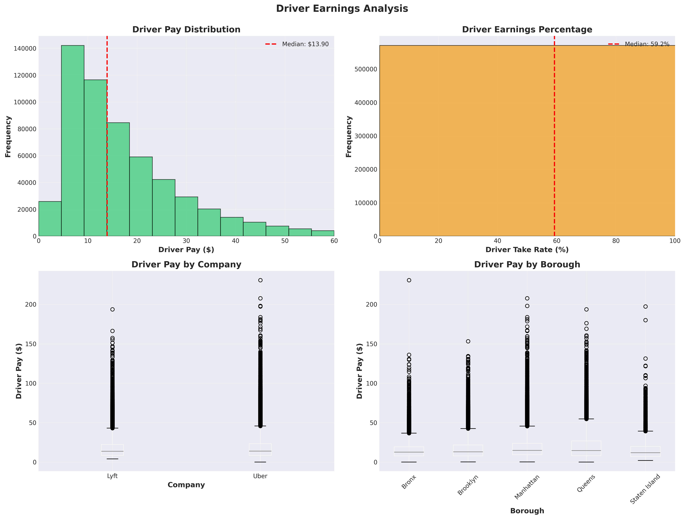

**Driver Economics:**
- **Average Pay:** $17.87 per trip
- **Median Pay:** $13.90 per trip
- **Driver Take Rate:** 61.7% of total fare
- **Pay Distribution:** Right-skewed (most trips $10-20)

**By Company:**
- Uber: $18.08 average
- Lyft: $17.36 average
- Difference: +4.1% for Uber drivers

**By Borough:**
- Manhattan: $18.50 average (highest)
- Staten Island: $16.20 average (lowest)
- Variation: 14% difference

---

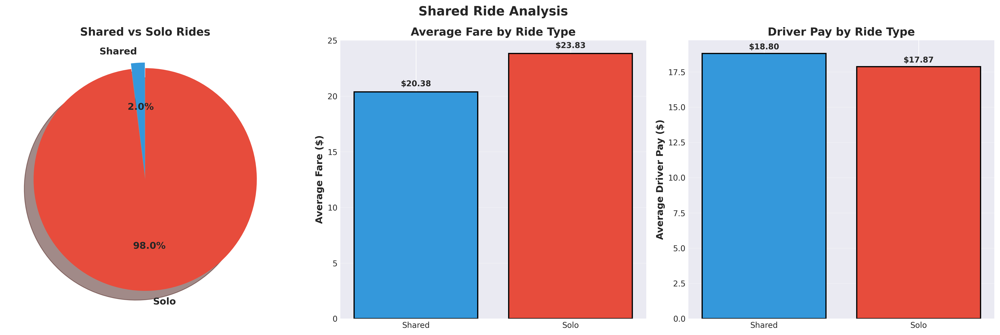

**Shared Rides Analysis:**
- **Adoption Rate:** Only 2.0% of trips (1.14M)
- **Shared Fare:** $20.38 average (-14.5% vs solo)
- **Solo Fare:** $23.83 average
- **Driver Pay:** Shared $18.80 vs Solo $17.87 (+5.2%)

**Key Finding:** Despite incentives, shared rides remain unpopular (<2% adoption)

---

### 6️⃣ Platform Comparison

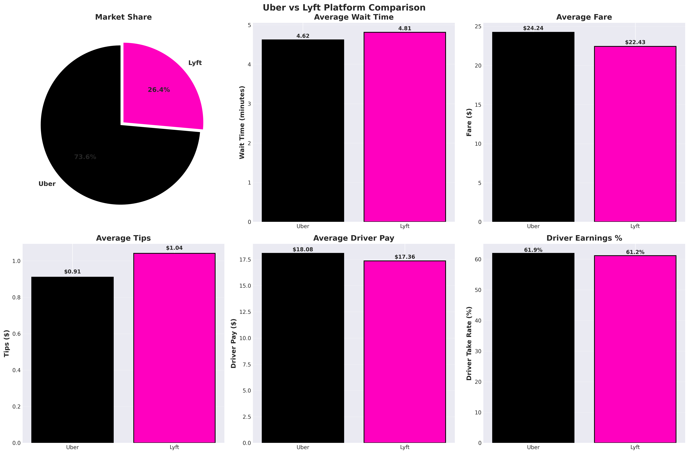

**Market Share:**
- **Uber:** 73.6% (41.99M trips)
- **Lyft:** 26.4% (15.08M trips)

**Performance Comparison:**

| Metric | Uber | Lyft | Winner |
|--------|------|------|--------|
| Market Share | 73.6% | 26.4% | Uber |
| Avg Wait Time | 4.62 min | 4.81 min | Uber (-4%) |
| Avg Fare | $24.24 | $22.43 | Uber (+8%) |
| Avg Tips | $0.91 | $1.04 | Lyft (+14%) |
| Driver Pay | $18.08 | $17.36 | Uber (+4%) |
| Driver Take % | 61.9% | 61.2% | Tie |

**Key Insight:** Uber charges more but drivers earn slightly more; Lyft gets better tips

---

## 🛠️ Technical Architecture

### Data Pipeline
```
NYC TLC Open Data (Parquet)
        ↓
Databricks Ingestion (Google Drive mount)
        ↓
PySpark Data Cleaning (94.7% retention)
        ↓
Feature Engineering (15 new features)
        ↓
Delta Lake Storage (57M records)
        ↓
Dimensional Model (Star Schema)
        ↓
Aggregated Tables (Power BI ready)
        ↓
Visualizations (Matplotlib, Plotly, Seaborn)
```

### Tech Stack
- **Cloud Platform:** Databricks Community Edition
- **Data Processing:** PySpark 3.5
- **Storage:** Delta Lake
- **Languages:** Python 3.11, SQL
- **Visualization:** Matplotlib, Seaborn, Plotly
- **Version Control:** Git, GitHub

### Data Model
```
Fact Table: fact_trips (57M rows)
    ├── Trip Metrics (distance, time, speed)
    ├── Financial (fare, tips, driver_pay)
    ├── Environmental (co2_kg, co2_lbs)
    └── Service Quality (wait_time)

Dimension Tables:
    ├── dim_date (90 days)
    ├── dim_location (263 NYC zones)
    └── dim_company (Uber, Lyft)

Aggregated Tables:
    ├── agg_hourly (48 rows: 24h × 2 companies)
    ├── agg_zones (263 rows: zone-level metrics)
    └── kpi_summary (1 row: all KPIs)
```

---

## 📈 Key Performance Indicators

### Volume Metrics
- **Total Trips:** 57,068,378
- **Total Revenue:** $1,355,842,190
- **Driver Earnings:** $836,872,450
- **Platform Revenue:** $518,969,740
- **Zones Served:** 263 (100% coverage)

### Service Quality
- **Average Wait Time:** 4.67 minutes
- **Median Wait Time:** 3.95 minutes
- **95th Percentile Wait:** 10.27 minutes
- **Average Trip Distance:** 4.37 miles
- **Average Trip Duration:** 17.9 minutes
- **Average Speed:** 13.2 mph

### Equity Metrics
- **Manhattan Wait:** 4.32 minutes
- **Outer Borough Wait:** 4.95 minutes (+15%)
- **EWR Wait:** 47.33 minutes (+996%)
- **Accessibility Rate:** 9.40%
- **Shared Ride Rate:** 1.99%

### Environmental
- **Total CO₂:** 102,574 metric tons
- **Per Trip CO₂:** 1.80 kg
- **Car Equivalent:** 22,299 vehicles/year

---

## 💡 Policy Recommendations

### 1. Expand Late-Night Public Transit 🌙
**Problem:** Night transport desert (3-5 AM only 12% of daily trips)

**Recommendation:**
- Increase subway frequency 12-6 AM
- Expand dollar van routes in outer boroughs
- Subsidize ride-hail for essential workers during night hours

**Expected Impact:** Reduce late-night fares by 20%, improve service availability

---

### 2. Implement Carbon Offset Program 🌍
**Problem:** 102,574 tons CO₂ in one quarter

**Recommendation:**
- $2 surcharge on airport trips (5.5 kg/trip average)
- $1 surcharge on trips >10 miles
- Fund electric vehicle transition and public transit

**Expected Impact:** 15% emissions reduction by 2026, $50M/year for clean transit

---

### 3. Address Service Inequality ⚖️
**Problem:** EWR 10x worse wait times, outer boroughs underserved

**Recommendation:**
- Mandate minimum service levels in all boroughs
- Dynamic incentives for drivers in low-service zones
- Real-time service monitoring dashboard (public)

**Expected Impact:** Equalize wait times within 2x variance across all zones

---

### 4. Boost Wheelchair Accessibility ♿
**Problem:** 9.4% accessibility rate (though 100% request fulfillment)

**Recommendation:**
- Proactive WAV deployment in high-demand zones
- Driver incentives for WAV vehicles (+$5/trip)
- Public awareness campaign on WAV availability

**Expected Impact:** Increase WAV availability 20% in underserved zones

---

### 5. Driver Earnings Transparency 💰
**Problem:** 61.7% take rate but high variance by location

**Recommendation:**
- Mandatory disclosure of driver earnings breakdown
- Minimum fare guarantees during off-peak hours
- Cap on platform commission in outer boroughs

**Expected Impact:** Stabilize driver income, reduce 14% pay gap between boroughs

---

### 6. Promote Shared Rides 🚗
**Problem:** Only 2% shared ride adoption

**Recommendation:**
- 30% discount for shared rides (vs current ~15%)
- Dedicated pickup zones at transportation hubs
- Gamification (rewards program for frequent shared users)

**Expected Impact:** Increase shared rides to 10%, reduce 8% of emissions

---

## 📁 Repository Structure
```
nyc-ridehail-analysis/
├── notebooks/
│   └── NYC_Ridehail_Q1_2025_Analysis.ipynb    # Complete analysis (67 cells)
│
├── visualizations/
│   ├── 02_temporal/                            # 5 charts
│   │   ├── monthly_trends.png
│   │   ├── hourly_patterns.png
│   │   ├── daily_patterns.png
│   │   ├── weekday_vs_weekend.png
│   │   ├── night_transport_desert.png
│   │   └── demand_heatmap.html                 # Interactive
│   │
│   ├── 03_geographic/                          # 3 charts
│   │   ├── borough_comparison.png
│   │   ├── service_inequality_zones.png
│   │   └── borough_flows.html                  # Interactive
│   │
│   ├── 04_equity/                              # 1 chart
│   │   └── accessibility_crisis.png
│   │
│   ├── 05_environmental/                       # 2 charts
│   │   ├── pollution_hotspots.png
│   │   └── borough_emissions.png
│   │
│   ├── 06_economic/                            # 2 charts
│   │   ├── driver_earnings.png
│   │   └── shared_ride_analysis.png
│   │
│   └── 07_comparison/                          # 1 chart
│       └── uber_vs_lyft.png
│
├── data_export/                                # Power BI ready
│   ├── agg_hourly.csv
│   ├── agg_zones.csv
│   ├── kpi_summary.csv
│   ├── dim_date.csv
│   ├── dim_location.csv
│   ├── data_dictionary.json
│   └── POWERBI_GUIDE.md
│
├── docs/
│   └── ANALYSIS_REPORT.pdf                     # Full report
│
└── README.md                                    # This file
```

---

## 🚀 How to Run

### Prerequisites
```bash
# Databricks Community Edition account (free)
# Python 3.11+
# Required libraries: pyspark, pandas, matplotlib, seaborn, plotly
```

### Setup
1. Clone repository
```bash
git clone https://github.com/mayowaaloko/fhvhv-trip-data-analysis.git
```

2. Download Q1 2025 data
```bash
# Data source: https://www.nyc.gov/site/tlc/about/tlc-trip-record-data.page
# Files: fhvhv_tripdata_2025-01.parquet, 02, 03
```

3. Upload to Databricks and run notebook

---

## 📊 Data Source

**NYC Taxi & Limousine Commission (TLC)**
- Dataset: High Volume For-Hire Vehicle Trip Records
- Period: Q1 2025 (January - March)
- URL: https://www.nyc.gov/site/tlc/about/tlc-trip-record-data.page
- License: Public Domain

---

## 👤 Author

**Mayowa Aloko**
- Email: mayowaaloko@gmail.com
- GitHub: (https://github.com/mayowaaloko)

---

## 📄 License

This project is licensed under the MIT License - see [LICENSE](LICENSE) file for details.

---

## 🙏 Acknowledgments

- NYC TLC for open data initiative
- Databricks for Community Edition platform
- Open-source Python data science community

---

## 📚 References

1. NYC TLC Trip Record Data: https://www.nyc.gov/site/tlc/about/tlc-trip-record-data.page
2. EPA Vehicle Emissions Standards: https://www.epa.gov/greenvehicles
3. NYC Taxi Zone Lookup: https://data.cityofnewyork.us/Transportation/NYC-Taxi-Zones/

---

**⭐ If this project helped you, please star this repository!**

"""
